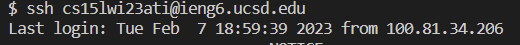

Welcome back to my CSE 15L blog everyone! This week in our lab we did a speed competition in the command line. We had to log into our ieng6 account, then clone into a java repository containing a bugged java file and a tester for it. Once in, we had to run the tests to show it was broken, then correct the bug, rerun the tester, and push and commit our changes back to the git repository.

First we had to log into our ieng6 account. We previously set this up to bypass our password to speed up the process. Since I had been doing these tasks repeatedly, it was my most recent command.

Keys Pressed: `<up><enter>`

	
git clone git@github.com:NathanD0wd/lab7
cd lab7
javac -cp .:lib/hamcrest-core-1.3.jar:lib/junit-4.13.2.jar *.java;java -cp .:lib/hamcrest-core-1.3.jar:lib/junit-4.13.2.jar org.junit.runner.JUnitCore ListExamplesTests
sed -i '43s/.*/index2 += 1;/' ListExamples.java
javac -cp .:lib/hamcrest-core-1.3.jar:lib/junit-4.13.2.jar *.java;java -cp .:lib/hamcrest-core-1.3.jar:lib/junit-4.13.2.jar org.junit.runner.JUnitCore ListExamplesTests
git add ListExamples.java
git commit -m 'Updates ListExamples'
git push
