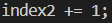

Welcome back to my CSE 15L blog everyone! This week in our lab we did a speed competition in the command line. We had to log into our ieng6 account, then clone into a java repository containing a bugged java file and a tester for it. Once in, we had to run the tests to show it was broken, then correct the bug, rerun the tester, and push and commit our changes back to the git repository.

First we had to log into our ieng6 account. We previously set this up to bypass our password to speed up the process. Since I had been doing these tasks repeatedly, it was my most recent command.

Keys Pressed: `<up><enter>`

Once in, we had to clone the github repository. Before doing this, I copied the url of my forked repository from the browser.

Keys Pressed: `<g><i><t><space><c><l><o><n><e><space><ctrl+v><enter>`

Then I had to change my directory into the cloned repository.

Keys Pressed: `<c><d><space><l><tab><enter>`

After doing this, I went to the bottom of the cs15l week7 page and copied the command to compile the testers. Then pasted this into the command line.

Keys Pressed: `<ctrl+v><enter>`

Then I copied the command from the line under to run the tester, pasted this into the command line, and added ListExamplesTester after.

Keys Pressed: `<ctrl+v><space><L><tab><T><tab><backspace>`

The reason I had to use tab twice is because the first L has two possibilities, ListExamples and ListExamplesTests. So it only fills up to the first one. Then after doing T tab, it adds on an unnecessary period, so I had to delete it.

Now I had to fix the broken code. Having previously looked through the code, I knew the error was on line 43. index1 was being incremented rather than index2. I opened the file with nano and corrected the error.

Keys Pressed: `<n><a><n><tab><L>tab><.><j><tab><enter><hold down arrow til line 43><hold right arrow til col 13><backspace><2><ctrl+o><enter><ctrl+x>`

Then I had to recompile and rerun the tester. I used the up arrows for this.

Keys Pressed: `<up><up><up><enter><up><up><up><enter>`

After fixing the code, I had to send the changes to my github repository. First I had to add the necessary changes.

Keys Pressed: `<g><i><t><space><a><d><d><space><L><tab><.><j><tab><enter>`

Then commit the changes. In a real commit, I would write a message explaining what I did, but for the sake of speed, I left it at U.

Keys Pressed: `<g><i><t><space><c><o><m><m><i><t><space><-><m><space><'><U>`

Finally, push the change.

Keys Pressed: `<g><i><t><space>
<u><s><h>`

Those are the steps I would have followed if I was doing this with no prep. However, for the sake of the competition, I had to for speed. So, I edited the bash_profile file to run all of these steps(replaced nano with a sed command) upon sshing into my ieng6 account. This got my time down to under 7 seconds. However I still did not win in my lab, the winning time was under two seconds. The guy used some bash wizardry or something and set a record. But I was still happy with my time. I wish you luck if you try to complete this challenge yourself. Thanks for reading.

Nathan
