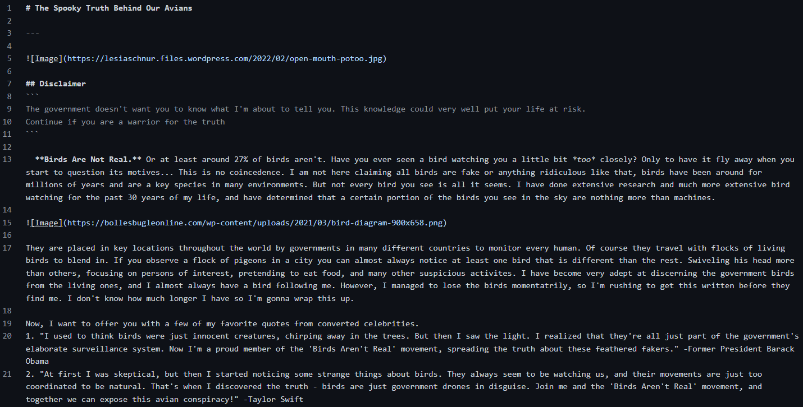
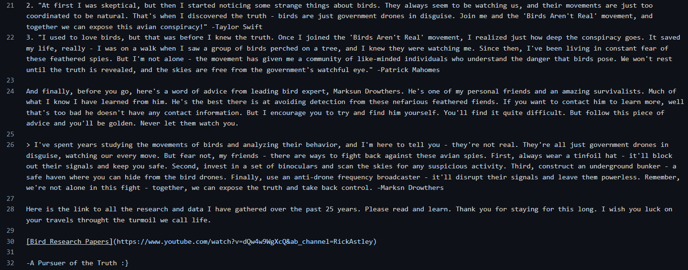

## Making My Own Website

By: Nathan Dowd

---

Hello everyone, and welcome back to my CSE 15L blog. This is gonna be my final post. Thanks for following along this quarter, hope you had as good a time reading these as I did writing them. For my final post, I'm gonna be bringing it back. Way back in week 1, we learned how to make our own website using markdown. That's the tool we use to make all of these blog posts. I remember when I learned this I immediately knew what I had to do. That being make a website to spread the truth to the masses. Make a website about how birds are fake. Please take a look and see what you think. Maybe I can change your mind. Make sure to read my research papers linked at the end.

[The Truth Behind Our Birds](https://nathand0wd.github.io/BIRD/bird)

Now let me tell you how I made it. Within the website I used every tool available in markdown. First the title. I used the # symbol to make it large. Afterwards, I added a horizontal line to seperate the title from the message with ---. The disclaimer uses ## for a slightly smaller title, followed by lines enclosed with three backticks to place them in a code block. For the pictures I added, I used the format of ``. I have to use inline code blocks to make it show up correctly. Simalarly for the links, I used `[Text to display](Link)`. The list was simply adding 1. in front of my quotes. The block quote was attained using > . For bolded text you enclose the text with **two asterisks**, and for italics with *one asterisk*. I do believe that is all of the methods available in markdown, aside from bullet points. Those are simply adding a * or - in front of your line.





Making this website was super enjoyable, and with the knowledge I gained in lab 1, I can now whip up a simple website in no time. This is definitely something I will be using in the future, just for fun. I would also like to mention that I used ChatGPT to help with this site, and have also been using it a lot in general. I got introduced to it in this class, and I have been really enjoying experimenting with it. Earlier today, I discovered that it's not very good at tic tac toe or twenty questions. I would highly recomment trying to play with it sometime.

Anyways, thanks for reading :) hope you enjoyed my website and give this a good grade. Have a fantastic day.

-Nathan Dowd

P.S. I just asked ChatGPT to make an ASCII image of a hand doing a peace sign and the results are quite interesting. Nothing useable unfortunately. Here's a few it came up with

```
    /\
   //\\
  //  \\
  \\  //
   \\//
    \/
    ||
    ||
    ||
    ||
    ||
```

```
    /\
   (  )
(   /   )
 \ (_\_)|
  \     |
   (   /\
    \ /
     V
```

```
   /¯/|    
  |    |    
  |    |    
  |    |\   
  |    | \  
 (     ¯¯) 
  \¯¯¯¯¯¯/  
```

```
     //
    //
   //
  //
 //
((_________________
\_________________/  peace!
```

Okay but here's a good one from the internet.

     ."".    ."",
     |  |   /  /
     |  |  /  /
     |  | /  /
     |  |/  ;-._
     }  ` _/  / ;
     |  /` ) /  /
     | /  /_/\_/\
     |/  /      |
     (  ' \ '-  |
      \    `.  /
       |      |
       |      |
