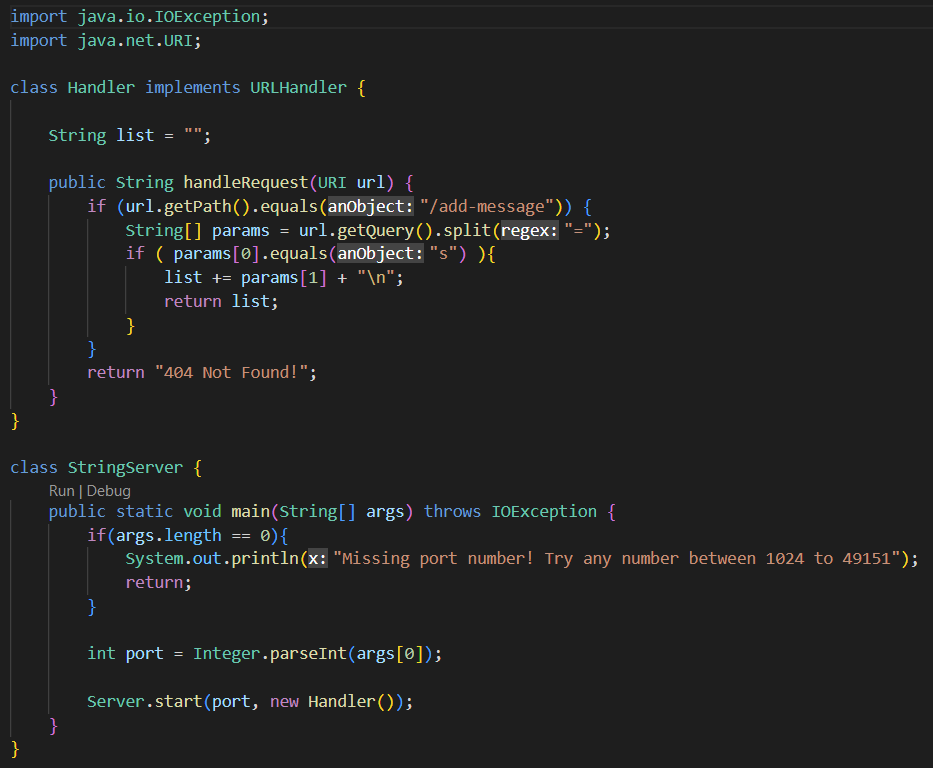

# Servers and Bugs
By: Nathan Dowd

---

This week, I will be demonstrating a web server I have written. The purpose of this web server is to receive Strings and return a running list of the Strings it is given. Shown below is the code to implement this.

No I will start the server and demonstrate how it works. I will be running this server from the CSE 15L remote server, ieng6. After compiling and running StringServer.java(used port number 4321), the web page is opened at http://ieng6-202.ucsd.edu:4321. However, to use it, we must add a path and query to the address. The only path that is accepted is /add-message, and the query that is excepted is ?s=(any String). Below I will show two examples of me using the website, and explain what is happening in each.
