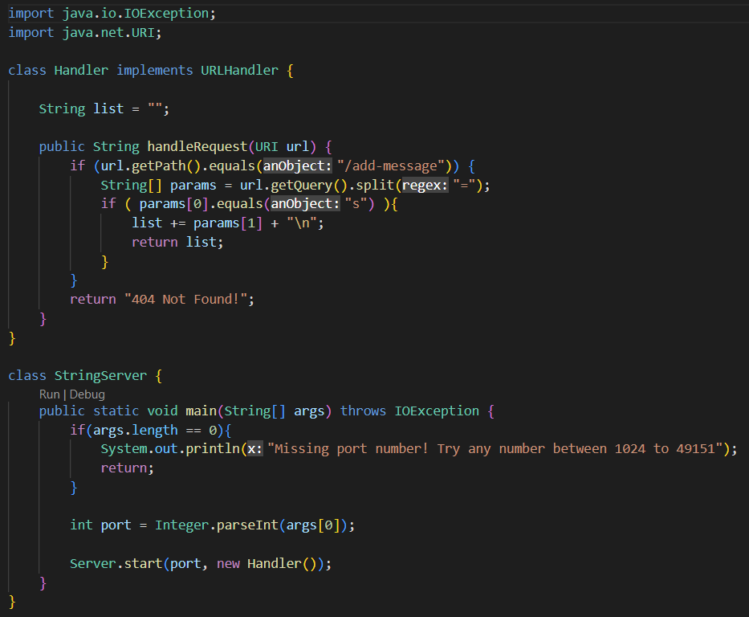
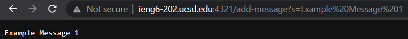
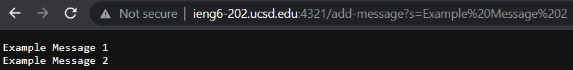

# Servers and Bugs
By: Nathan Dowd

---

## Web Server

This week, I will be demonstrating a web server I have written. The purpose of this web server is to receive Strings and return a running list of the Strings it is given. Shown below is the code to implement this. This code implements the interface URLHandler, which was provided during CSE 15L Lab 2 and allows for the web server to work.


Now I will start the server and demonstrate how it works. I will be running this server from the CSE 15L remote server, ieng6. After compiling and running StringServer.java(used port number 4321), the web page is opened at http://ieng6-202.ucsd.edu:4321. However, to use it, we must add a path and query to the address. The only path that is accepted is /add-message, and the query that is excepted is ?s=(any String). Below I will show two examples of me using the website, and explain what is happening in each.


In this example, the method called within my code is StringServer. The input it takes is the URL/URI we inputted (http://ieng6-202.ucsd.edu:4321/add-message?s=Example Message 1). The only value of any signifigance within the StringServer class is the String list. To begin it is empty. When the StringServer method is called its contents are updated with the value of the String following the s= in the query. A new line symbol is also added after this so the next String received is outputted on the next line.



This example is very similar to the last one. The same method is called (StringServer), receiving another URL/URI as input, within the same class (StringServer). The only value within the class (list) is the only thing updated again. This time it begins holding the value "Example Message 1\n". After the method is run, the String following the s= in the query is again added to list. This leaves the value within list as "Example Message 1\nExample Message 2".

That is how I ran a web server to take Strings and display the ones it is given in a list.

## Bugs and Debugging

Tester That Outputs an Error

```
@Test
    public void mergeError() {
        List<String> input1 = new ArrayList<String>();
        List<String> input2 = new ArrayList<String>();
        List<String> output1 = new ArrayList<String>();
        input1.add("a");
        input2.add("b");
        input2.add("c");
        input1.add("e");
        input2.add("f");
        input2.add("g");
        output1.add("a");
        output1.add("b");
        output1.add("c");
        output1.add("e");
        output1.add("f");
        output1.add("g");
        assertEquals( output1 , ListExamples.merge(input1, input2) );
    }
  ```
  
Tester With No Error
  
  ```
@Test
public void mergeNoError() {
      List<String> input1 = new ArrayList<String>();
      List<String> input2 = new ArrayList<String>();
      List<String> output1 = new ArrayList<String>();
      input1.add("a");
      input2.add("b");
      input2.add("c");
      input1.add("e");
      input2.add("f");
      input1.add("g");
      output1.add("a");
      output1.add("b");
      output1.add("c");
      output1.add("e");
      output1.add("f");
      output1.add("g");
      assertEquals( output1 , ListExamples.merge(input1, input2) ); 
  }
 ```
    
Code With Error

```
static List<String> merge(List<String> list1, List<String> list2) {
    List<String> result = new ArrayList<>();
    int index1 = 0, index2 = 0;
    while(index1 < list1.size() && index2 < list2.size()) {
      if(list1.get(index1).compareTo(list2.get(index2)) < 0) {
        result.add(list1.get(index1));
        index1 += 1;
      }
      else {
        result.add(list2.get(index2));
        index2 += 1;
      }
    }
    while(index1 < list1.size()) {
      result.add(list1.get(index1));
      index1 += 1;
    }
    while(index2 < list2.size()) {
      result.add(list2.get(index2));
      index1 += 1;
    }
    return result;
  }
  ```
