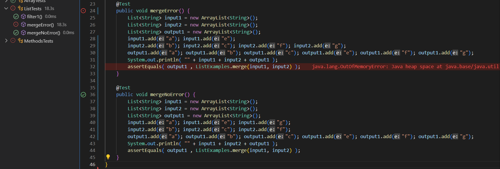

# Servers and Bugs
By: Nathan Dowd

---

## Web Server

This week, I will be demonstrating a web server I have written. The purpose of this web server is to receive Strings and return a running list of the Strings it is given. Shown below is the code to implement this. This code implements the interface URLHandler, which was provided during CSE 15L Lab 2 and allows for the web server to work.


Now I will start the server and demonstrate how it works. I will be running this server from the CSE 15L remote server, ieng6. After compiling and running StringServer.java(used port number 4321), the web page is opened at http://ieng6-202.ucsd.edu:4321. However, to use it, we must add a path and query to the address. The only path that is accepted is /add-message, and the query that is excepted is ?s=(any String). Below I will show two examples of me using the website, and explain what is happening in each.


In this example, the method called within my code is StringServer. The input it takes is the URL/URI we inputted (http://ieng6-202.ucsd.edu:4321/add-message?s=Example Message 1). The only value of any signifigance within the StringServer class is the String list. To begin it is empty. When the StringServer method is called its contents are updated with the value of the String following the s= in the query. A new line symbol is also added after this so the next String received is outputted on the next line.


This example is very similar to the last one. The same method is called (StringServer), receiving another URL/URI as input, within the same class (StringServer). The only value within the class (list) is the only thing updated again. This time it begins holding the value "Example Message 1\n". After the method is run, the String following the s= in the query is again added to list. This leaves the value within list as "Example Message 1\nExample Message 2".

That is how I ran a web server to take Strings and display the ones it is given in a list.

## Bugs and Debugging

In this section I will be discussing bugs and debugging, as the title suggests. We were given classes and methods in our lab that contained errors. The class we are focusing on is ListExamples.java and within that class is the Merge method. Below you can see the code. The purpose of this code was to merge two previously sorted lists, keeping them sorted in alphabetic order. (Ex: { a , c , d } + { b , e , f } = { a , b , c , d , e , f } )

Code With Bug

```
static List<String> merge(List<String> list1, List<String> list2) {
    List<String> result = new ArrayList<>();
    int index1 = 0, index2 = 0;
    while(index1 < list1.size() && index2 < list2.size()) {
      if(list1.get(index1).compareTo(list2.get(index2)) < 0) {
        result.add(list1.get(index1));
        index1 += 1;
      }
      else {
        result.add(list2.get(index2));
        index2 += 1;
      }
    }
    while(index1 < list1.size()) {
      result.add(list1.get(index1));
      index1 += 1;
    }
    while(index2 < list2.size()) {
      result.add(list2.get(index2));
      index1 += 1;
    }
    return result;
  }
  ```

Here is a test method that I wrote to test the class. It creates two lists input1 = { a , e } and input 2 = { b , c , f , g }, and then attempts to merge them. The expected ouput should be: output1 = { a , b , c , e , f, g }.

Tester With Error

```
@Test
    public void mergeError() {
        List<String> input1 = new ArrayList<String>();
        List<String> input2 = new ArrayList<String>();
        List<String> output1 = new ArrayList<String>();
        input1.add("a"); input1.add("e");
        input2.add("b"); input2.add("c"); input2.add("f"); input2.add("g");
        output1.add("a"); output1.add("b"); output1.add("c"); output1.add("e"); output1.add("f"); output1.add("g");
        assertEquals( output1 , ListExamples.merge(input1, input2) );
    }
  ```
  
Here is another test method. It creates two lists input1 = { a , g , e } and input 2 = { b , c , f ,}, and then attempts to merge them. The expected ouput should be: output1 = { a , b , c , e , f, g }.

Tester With No Error
  
  ```
@Test
public void mergeNoError() {
      List<String> input1 = new ArrayList<String>();
      List<String> input2 = new ArrayList<String>();
      List<String> output1 = new ArrayList<String>();
      input1.add("a"); input1.add("g"); input1.add("e");
      input2.add("b"); input2.add("c"); input2.add("f");
      output1.add("a"); output1.add("b"); output1.add("c"); output1.add("e"); output1.add("f"); output1.add("g");
      assertEquals( output1 , ListExamples.merge(input1, input2) ); 
  }
 ```
    
When we run these tests we get one error and one successful test. As you can see below. mergeNoError runs with no error, producing the output expected that we stated above. MergeError, however, runs into an infinite loop and exits without completing.



The bug is within the last while loop in the code. This loop will happen if there are more elements in list2 than in list1. The first while loop will iterate through both lists until it reached the end of one. It updates index1 and index2 as it goes. However, when it enters the last loop, it updates index1 while going through list2. Then in the while loop if statement, it compared index2 < list2.size(). Since index2 is never increased in the loop, that statement always returns true, so the list continues to run and results in an infinite loop. To fix this, we change the inside of the loop to iterate index2 instead of index1. Below you can see the new code with no bugs.

Code Without Bug
```
static List<String> merge(List<String> list1, List<String> list2) {
    List<String> result = new ArrayList<>();
    int index1 = 0, index2 = 0;
    while(index1 < list1.size() && index2 < list2.size()) {
      if(list1.get(index1).compareTo(list2.get(index2)) < 0) {
        result.add(list1.get(index1));
        index1 += 1;
      }
      else {
        result.add(list2.get(index2));
        index2 += 1;
      }
    }
    while(index1 < list1.size()) {
      result.add(list1.get(index1));
      index1 += 1;
    }
    while(index2 < list2.size()) {
      result.add(list2.get(index2));
      index2 += 1;
    }
    return result;
  }
  ```
  
  ## What I Learned
In these past two labs, I have learned a lot. The thing that stood out to me most though was the connection between GitHub and our coding, more specifically VSCode. You can easily use files from GitHub in VSCode with the git clone method, and using GitHub Desktop allows you to keep track of all the changes you make within VSCode in GitHub. I have always known the purpose of GitHub was to store code and keep track of changes made to it, but I never actually understood how that worked until our lab in week 2. This will be a super useful tool in the future.
